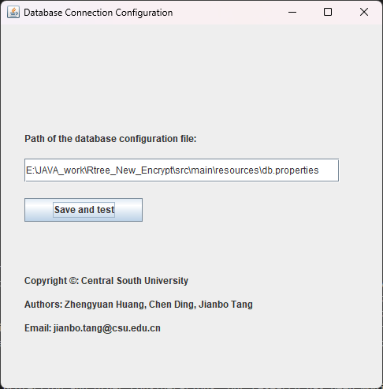
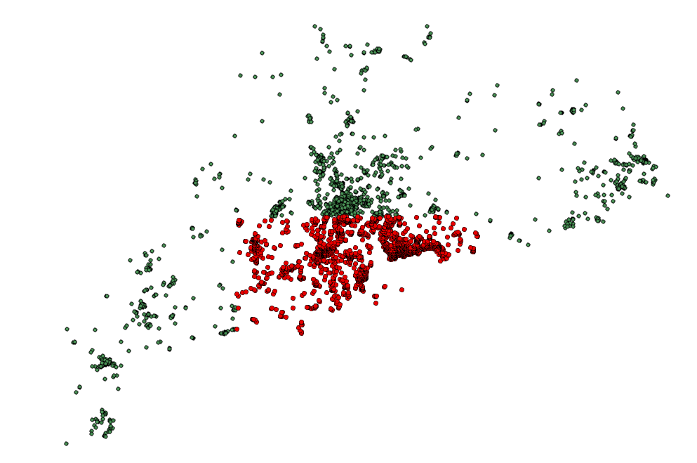
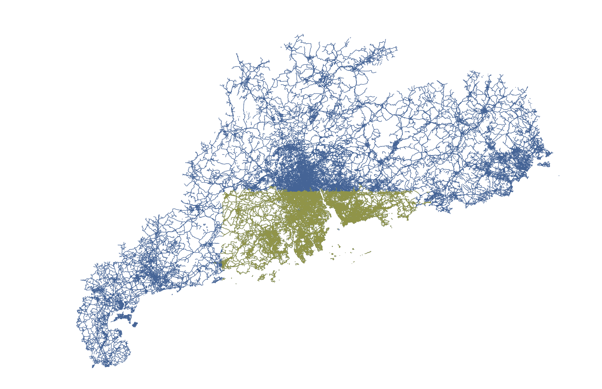

# Local encryption method for map data

This repository contains the test datasets, source codes, and the executable app for the local encryption method for map vector data. The details of the method can be found in paper "***A local encryption method for large-scale vector maps based on spatial hierarchical index and 4D hyperchaotic system***" (https://doi.org/10.1080/13658816.2024.2381225).

> [!NOTE]
>
> The executable app is released by Zhengyuan Huang and Jianbo Tang. The instructions to install and use the executable app are listed in the following.


# Platform
The executable app runs on **Windows 10/11** ,**Java-1.8**, operating systems and requires a locally configured **PostgreSQL** database. The operational data must be stored in a database with the **PostGIS** extension enabled. Additionally, a database connection configuration file must be present on the disk. Please refer to the provided **db.properties** file in the compressed package for the correct file format.

The **encrypt** folder provided under this project contains files such as ***keys and tree index files*** generated during the example data encryption process. These files are required during the decryption process. The **key** folder contains public and private keys generated from passwords and passphrases. It is not recommended to directly use the files in these two folders during reproduction, as multiple testing experiments may have caused inconsistencies, and they might correspond to different passwords and passphrases. These files are provided only as format references. To reproduce the process, please refer to the operation steps and example data results. The content in the parameter input .txt file (Samples_parameters.txt) is also for reference purposes only.


```
Window10/11  Java-1.8  PostgreSQL + PostGIS

-Example db.properties:
#Database Connection Properties
#Fri Nov 01 20:44:25 CST 2024
dbtype=postgis
user=postgres
port=5432
url=jdbc\:postgresql\://localhost\:5432/en
password=123456
schema=public
host=localhost
database=en
```

# Install
git lfs install

git lfs clone https://github.com/csu-mapping/map-encryption.git


# Steps to run the app

The overall approach is as follows:
1. The user creates a database configuration file (an example of the configuration file is provided in the db.properties file) and inputs the path of the configuration file into the initial window. Upon successfully connecting to the user’s database, a key generation window will pop up.
2. In the key generation window, both public and private keys can be generated, which are used in the encryption and decryption processes, respectively. The user inputs a random string as the User token, then a fixed 16-character alphanumeric password, and specifies the paths for generating the public and private keys.
3. The encryption process requires the user to select the type of data to be encrypted, input the name of the spatial data table in the connected database to be encrypted, and provide the public key path and the path for generating the decryption file.
4. The decryption process requires the user to select the type of data to be decrypted, input the name of the spatial data table in the connected database that needs to be decrypted, as well as the key for the table, its RTree file, and the RTree index file. Finally, the user specifies the name for the decryption result and the area to be decrypted.
5. The encryption process requires the public key and password, so the password must be entered before encryption; the decryption process requires the private key, the key for the file being decrypted, the RTree file and its index file, as well as the selected range.
6. The unique corresponding public and private keys are determined through the user token and password, and the public and private keys used for decryption of the encrypted file must match the ones used for encryption.

# Note
> [!NOTE]
>
> Due to the complexities arising from patent protection and other considerations, our research has been modified and encapsulated, providing only an executable EXE file to validate the correctness of our methodology.
> *Due to the nature of range decryption, which involves selecting RTree nodes within the specified range for decryption, the actual decryption range will be larger than the input range. In the point decryption process, we filter out points that are not within the decryption range. However, in line and area decryption, due to the integrity of lines and areas, we retain all the contents of the entire leaf nodes.*
> *In the decryption of polygon features, there may be topological issues with the structure of the decrypted features, which can lead to display problems in mainstream GIS software. This is due to the structural characteristics of polygon features where the boundary points are connected. However, the correct results can be displayed normally in the database. This EXE file is limited to verifying the correctness of the methodology of this experimental work.*


# Example data and Results



In the above image, the green point area represents the original data, while the magenta points represent the results of the range decryption, overlaid on the original data.



